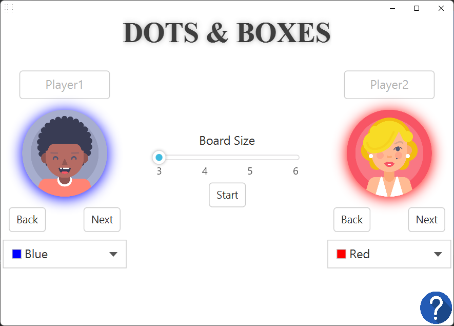
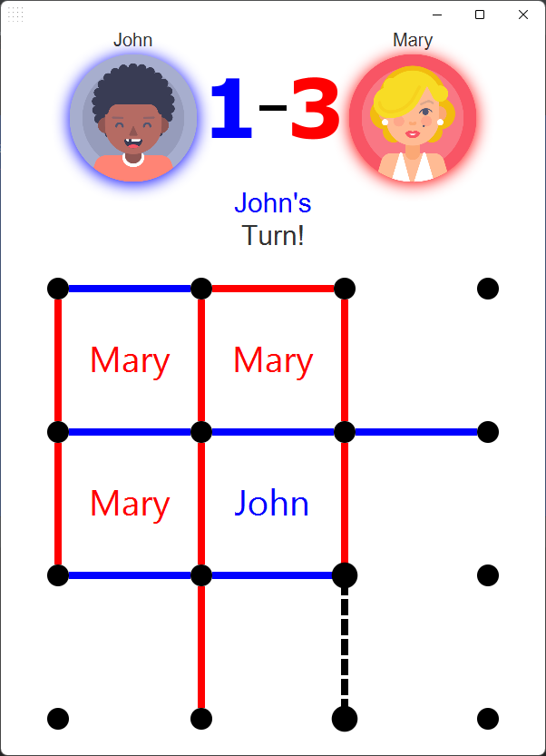

# Dots and Boxes
Dots and Boxes is a classic game that can be played by two players on a grid of dots. The goal of the game is to surround as many boxes as possible with lines, and the player who surrounds the most boxes wins. This version of the game is implemented in JavaFX and allows the player to customize the game experience by setting the player names, selecting the color and avatar for each player, and choosing the size of the game board.

## Menu

The first thing the player will see when starting the game is the menu, where they can set the player names, select a color and avatar for each player, and choose the size of the game board.

The player can enter the name of player 1 and player 2 in the corresponding text fields, then they can select a color for each player by clicking on the color picker and choosing a color. They can also select an avatar for each player by clicking on the avatar button and choosing an avatar from the available options. Finally, they can choose the size of the game board by using the drop-down menu.

## In-game View

Once the player has set up the game, they will be taken to the in-game view, where they can start playing.

The game board is displayed in the center of the screen, with the player names, scores, and avatars displayed on the top of the screen. The players take turns playing, with player 1 starting first. The player can place a line between two dots by clicking on the dot. Once a player completes a box, that box will be filled with the color of the player and the player will gain a point. The game ends when all the boxes are filled and the player with the most points wins.

## Setting up the game
To set up and run the game, you will need to have the following installed:
- Clone or download the game from Github.
- Open the project in IDEA or any other Java IDE.
- Run the Main class, which will open the menu where you can set up the game.
- Once you have set up the game, click on the start button to start playing.

## Rules of the game
- The game is played on a grid of dots.
- Two players take turns connecting dots with lines.
- Once a player completes a box, that box will be filled with the color of the player and the player will gain a point.
- The player with the most points at the end of the game wins.
- If all the boxes are filled and the players have the same number of points, the game ends in a draw.

## Features
- Customizable player names, colors, and avatars.
- Choice of game board size.
- In-game scores and avatars display.
- Game over screen with the option to play again or return to the main menu.

## Conclusion
Dots and Boxes is a classic and simple game that can be enjoyed by players of all ages. This JavaFX offers a fun and challenging way to pass the time.

- **Developed by:** Marios Plenchidis
  - Role: Full Stack Developer
  - Contact: mariosplenchidis@gmail.com
  - [LinkedIn](https://www.linkedin.com/in/marios-p-12313a203/)
